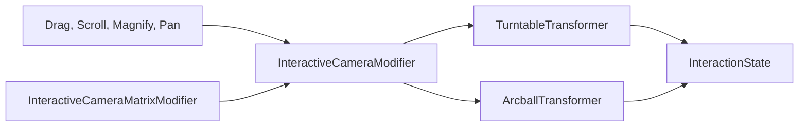

x# Controllers

Interactive camera control system. Gestures feed into a modifier that delegates to a transformer to update camera state.

## Types

| Type | Role |
|------|------|
| **InteractiveCameraModifier** | Orchestrator — wires gestures to a transformer, owns state bindings |
| **InteractiveCameraMatrixModifier** | Convenience wrapper that works with a `matrix_float4x4` binding |
| **TurntableTransformer** | Fixed-axis orbit: yaw around world Y, pitch around world X, clamped |
| **ArcballTransformer** | Free rotation via virtual trackball projection |
| **InteractionState** | Camera state: rotation quaternion, distance, and target point |
