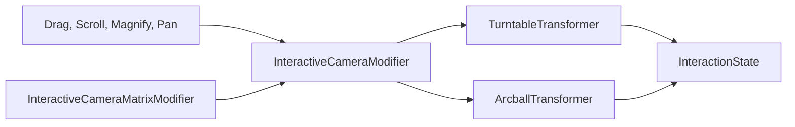

x# Controllers

Interactive camera control system. Gestures feed into a modifier that delegates to a transformer to update camera state.

```mermaid
graph LR
    Gestures["Drag, Scroll, Magnify, Pan"] --> ICM["InteractiveCameraModifier"]
    ICM --> TT["TurntableTransformer"]
    ICM --> AT["ArcballTransformer"]
    TT --> State["InteractionState"]
    AT --> State
    ICMM["InteractiveCameraMatrixModifier"] --> ICM
```

## Types

| Type | Role |
|------|------|
| **InteractiveCameraModifier** | Orchestrator — wires gestures to a transformer, owns state bindings |
| **InteractiveCameraMatrixModifier** | Convenience wrapper that works with a `matrix_float4x4` binding |
| **TurntableTransformer** | Fixed-axis orbit: yaw around world Y, pitch around world X, clamped |
| **ArcballTransformer** | Free rotation via virtual trackball projection |
| **InteractionState** | Camera state: rotation quaternion, distance, and target point |
| **CameraZoomModel** | `.additive` or `.multiplicative(rate:)` (log-scale) zoom, with a configurable distance range |
| **YawPitchDragModifier** | Drives yaw/pitch `Angle` bindings; backs `interactiveCamera(yaw:pitch:...)` and `interactiveLook(yaw:pitch:)` |

## Options

- **Up axis:** `TurntableTransformer(upAxis:)` orbits around any up axis (default +Y). `TurntableTransformer.yawPitch(of:upAxis:)` and `rotation(yaw:pitch:upAxis:)` convert between a rotation and angles.
- **Precision:** `interactiveCamera(rotation:distance:target:)` accepts `Float` or `Double` distance and target.
- **Pan:** pass `nil` for `target` (or `panEnabled: false` on `InteractiveCameraModifier`) to disable Command-drag pan.
- **Look-around:** `interactiveLook(yaw:pitch:pitchRange:)` for a camera at a fixed position; dragging moves the scene with the pointer.
